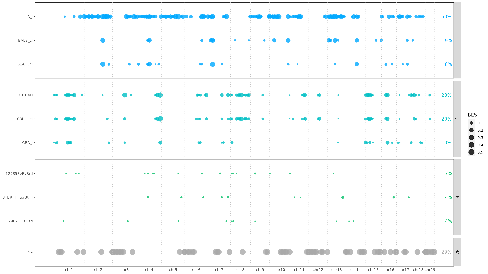
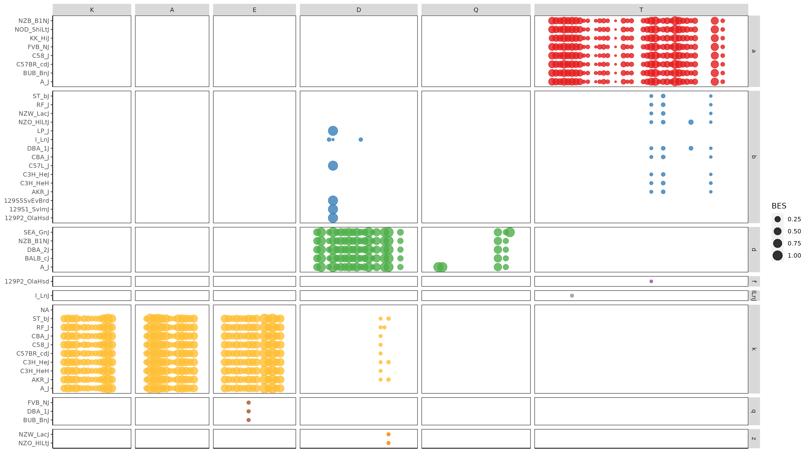
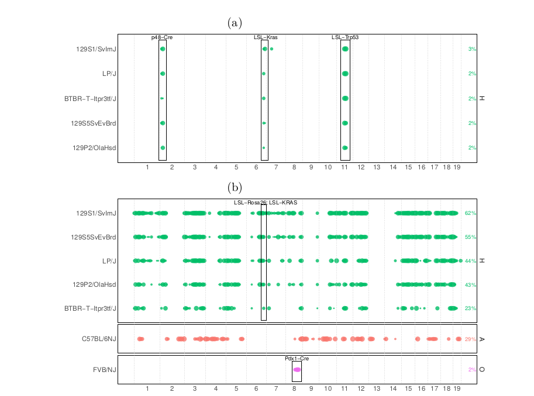

## MoGeLi: Analysis of mouse strains and MHC haplotypes

### Overview
MoGeLi is a tool to identify the strain(s) as well as the MHC haplotype(s) of mouse samples. 
MoGeLi only requires mapped reads (i.e. bam file) to extract variants (SNPs) to identify the genetic background, based on sequencing data from: WES, WGS, lcWGS, full-length RNA (experimental).
The raw genomic data (FASTQs) can be processing using our pipeline MoCaSeq but also any other NGS processing pipeline. RNA can be processed using STAR.

### Requirements
The core code was written entirely in R (tested on version 4.3.2), with the following package dependencies: 
- data.table (v1.14.8)
- splitstackshape (v.1.4.8)
- ggplot2 (v3.4.2)
- tidyr (v1.3.0)
- tidytext (v0.4.1)
- scales (v1.3.0)
- GenomicRanges (v1.52.0)

Additionally, the tool mgibio/bam-readcount is used, to extract variants from a given BAM file (docker, v0.8.0). 

All important data files can be found in the data/ folder and will be loaded in the main script. The only exception is the large mouse genome fasta file, which can for example be downloaded using: 

```
wget -nv "ftp://ftp.ncbi.nlm.nih.gov/genomes/all/GCA/000/001/635/GCA_000001635.8_GRCm38.p6/GCA_000001635.8_GRCm38.p6_genomic.fna.gz"
```


### Run
All the required functions are provided. For an example run, please follow the extensive cookbook example (blueprint script): EXAMPLE.R

### Result Interpretation
These are the result output plots for the provided example: MMR-48497 (JAX MMRDB, SRR1784009).
The sample comes from a mixed strain background (A/J + B6C3Fe/C3H). Additional information can be found here: https://www.jax.org/strain/1432


#### Strain identification
TL;DR: mixed strain identified with A/J (49%, blue bubbles) and C3H (~20%, teal bubbles).  



The strain (based on signature SNPs) is visualized with bubbles
for each chromosome (x-axis) and identified strain (y-axis). Each bubble represents a 10Mb genomic bin with a given normalized enrichment (bubble size) of variants of a certain strain (color). \
The summed length of all bubbles for a strain (genome-wide coverage), is noted as a percentage value at the right margin (also called global enrichment score or GES). Only strains with a sufficient GES (>5%, script parameter)
are shown and strains are categorized into strain groups (uppercase letters on
the right edge of each box). 

Due to similarities within each strain group, multiple strains of a group will arise, however only the strain with the highest GES in a group is considered to be representative for a sample (i.e. A_J with the closely related strains SEA/GnJ and BALB/cJ as passengers or C3H/HeH+HeJ with CBA/J as passenger). 

The assignment of a bubble and strain is not mutually exclusive, so multiple strains can be associated to the same genomic bin to identify mixed
strains. Genomic regions for which no strain was identified (e.g. all variants filtered) are shown as grey and "NA".

Important note: The strain C57BL/6J (commonly referred to as "Black6") is commonly us ase the reference genome, which means that it can not be identified as a specific strain. However, the absence of other strains in large genomic regions (i.e. "blankness" in plot) can be interpreted as being Black6 (assuming your input data is not broken). 


#### MHC haplotype identification
TL;DR: The MHC loci is associated to the A/J strain and the identified haplotype is "k-k-k-d-d-a" (defined nomenclature for the MHC gene clusters K-A-E-D-Q-T)  



The MHC haplotype (based on MHC-specific SNPs) is visualized with bubbles for each MHC gene cluster (x-axis: K,A,E,D,Q,T). The color as well as the grouping (y-axis) correspond to specific haplotypes (lowercase letters, right side). \
For example, the yellow bubbles completly fill the boxes for the MHC cluster K (H2-K1, H2-K2), A (H2-Aa) and E (H2-Ea), which indicates that the haplotype for these clusters is "k". \
Strain names (left side) can be ignored, as they occur multiple times as each box due to individual combinations of clusters and haplotypes. The plot can be interpreted by assuming the most prevalent haplotype ("most color bubbles filling a box") to be the representative haplotype for each cluster (but can also be more than one). The final MHC haplotype consists of the six cluster components (e.g. k-k-k-d-d-a-a for this strain A/J). Even though this sample also has the C3H strain mixed in, the MHC locus is only associated to the A/J strain (random breeding recombination). Focal events (e.g. cluster D with some hits for the haplotypes b and k) can in most cases be considered as noise. 

Note: Strains are associated to different MHC haplotypes, which can be found in several publicly available resources. Alternatively, this summary can be used, to find the matching strain to your MHC results: 

| **Strain**                                                              | **K** | **A** | **E** | **D** | **Q** | **T** |
| ----------------------------------------------------------------------- | ----- | ----- | ----- | ----- | ----- | ----- |
| C57BL/6NJ, C57BL/10J                                                    | b     | b     | b     | b     | b     | b     |
| 129P2/OlaHsd, C57L/J, LP/J, 129S1/SvImJ, 129S5SvEvBrd, BTBR/T/Itpr3tf/J | b     | b     | b     | b     | b     | f     |
| KK/HiJ                                                                  | b     | b     | b     | b     | b     | a     |
| NZB/B1NJ                                                                | d     | d     | d     | d     | d     | a     |
| BALB/cJ, DBA/2J, SEA/GnJ                                                | d     | d     | d     | d     | d     | d     |
| I/LnJ                                                                   | ILnJ  | ILnJ  | ILnJ  | b     | ILnJ  | ILnJ  |
| A/J                                                                     | k     | k     | k     | d     | d     | a     |
| C57BR/cdJ, C58/J                                                        | k     | k     | k     | k     | k     | a     |
| AKR/J, C3H/HeH, C3H/HeJ, RF/J, CBA/J, ST/bJ                             | k     | k     | k     | k     | k     | b     |
| NOD/ShiLtJ                                                              | NOD   | d     | q     | b     | NOD   | a     |
| FVB/NJ, BUB/BnJ                                                         | q     | q     | q     | q     | q     | a     |
| DBA/1J                                                                  | q     | q     | q     | q     | q     | b     |
| NZO/HlLtJ, NZW/LacJ                                                     | z     | z     | z     | z     | z     | b     |


#### Advanced analysis (identification of transgenic alleles)


MoGeLi can also be used to identify transgenic loci. 
Example (a) shows the results for a pure C57BL/6J (black6) strain (after backcrossing), with the engineered constructs p48-Cre, LSL-Kras and LSL-Trp53 being preserved across generations (positive selection). The constructs were generated/introduced based on a 129 strain background.

Example (b) shows a sample with a mixed background of 129 + black6 (C57BL/6J, C57BL/6NJ). Particularly striking is the transgenic loci Pdx1-Cre, which was generated on a FVB/NJ background. 

Additional note: MoGeLi can also be used to roughly assess the backcrossing status for a given sample, based on the number or intensity of identified non-black6 strains (i.e. colorful bubbles). 